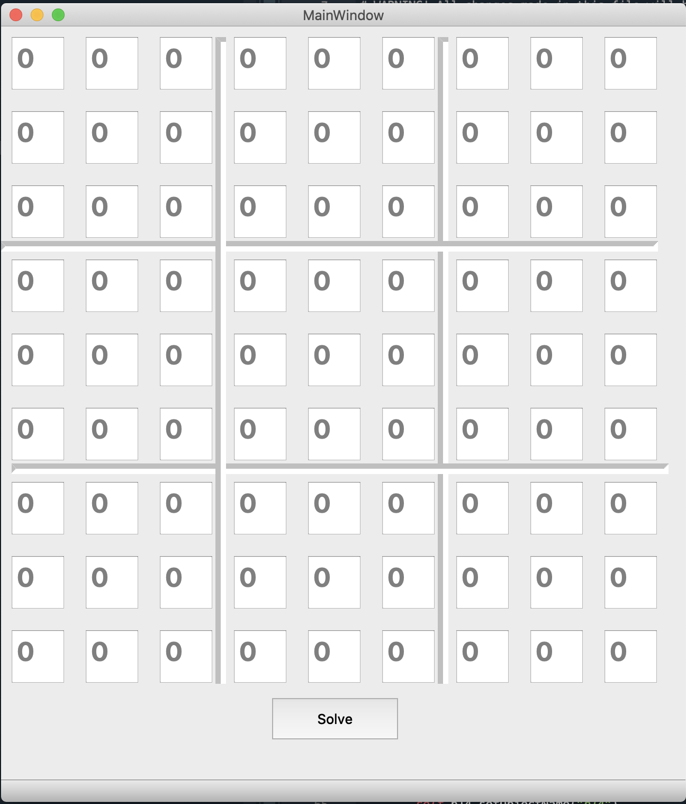
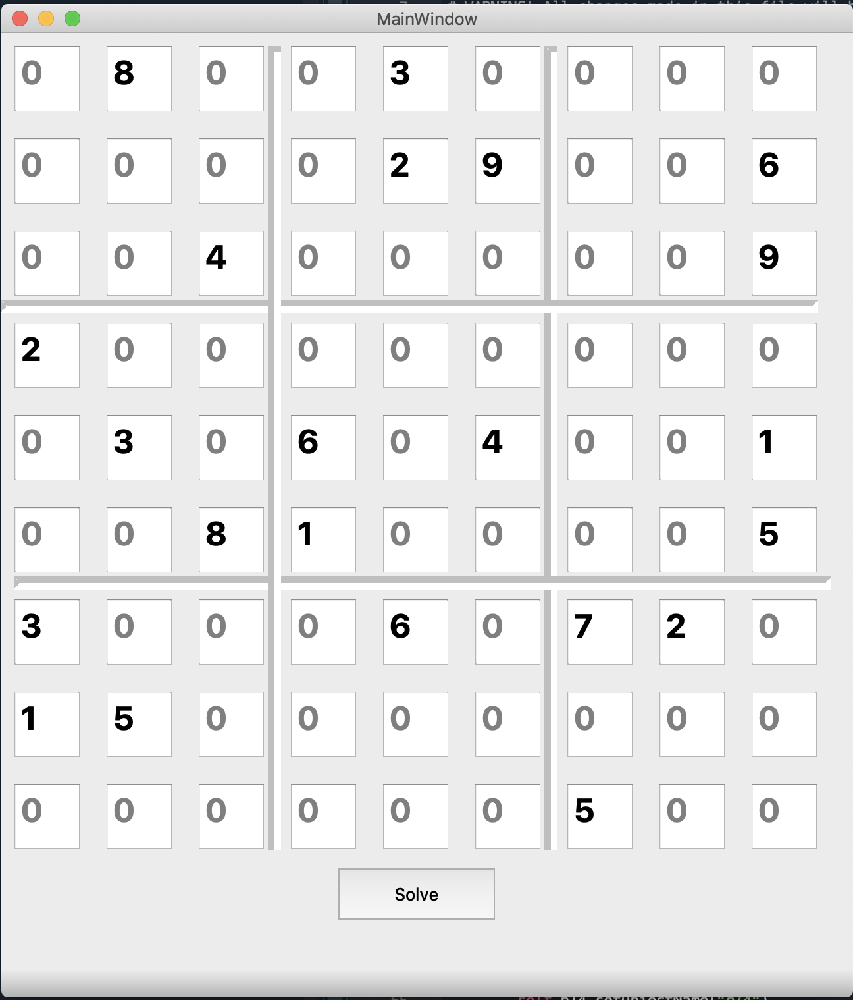
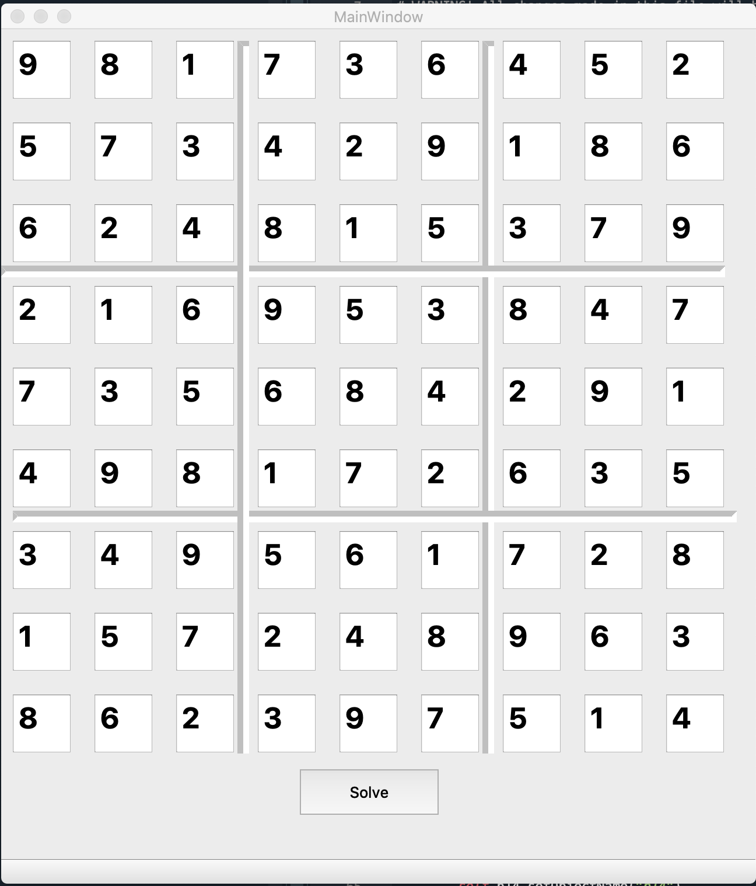
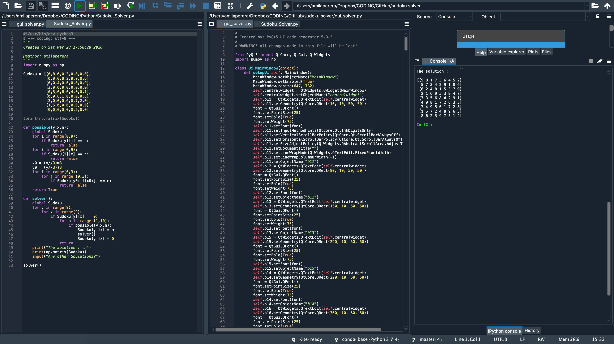

# sudoku.solver
This simple Sudoku.Solver will solve any difficult Sudoku puzzel. It will look for alternative solutions as well.

Once the solver is build, next step was to build a GUI so that the user can input any puzzel and solve it. QtDesigner was used to build the GUI and pyuic was used to translate to python code.

$ pyuic5 -x gui_solver.ui -o gui_solver.py

After incorpoprting the solver code and executing will promt the following GUI.

Fill in the array as needed.

Once you press the "Solve" Button, the soultion will be populated on the same GUI

If the puzzel have multiple solutions and when you press the "Solve" button once agon, it will populate with the next solution.

